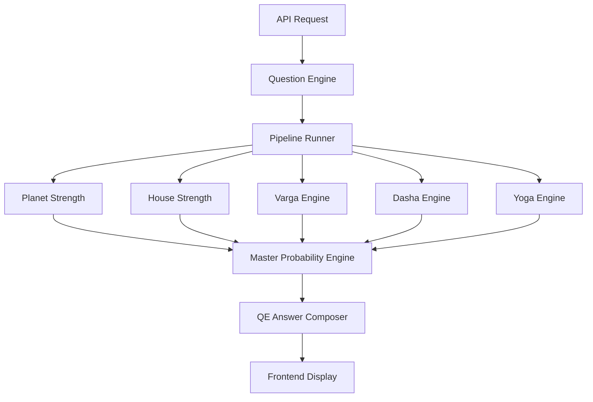

# PIPELINE RUNNER KNOWLEDGE PACKAGE

## 1. Executive Summary
The Pipeline Runner is the core infrastructure orchestrator of the Vedic AI Golden Master platform. It is the absolute singular authority for orchestrating the execution sequence and passing payloads (the Execution DAG) between all deterministic engines. It ensures that individual calculation engines remain perfectly isolated and ignorant of each other.

## 2. Architecture
The Pipeline Runner acts as the single canonical owner of the execution sequence. 
It receives the Canonical JSON horoscope and routes it through the necessary astrological engines before delivering the final payload to the Question Engine or Report System.

## 3. Global Execution Flow
*(Extracted from Question Engine)*
1. API receives a user query.
2. `QuestionEngine` routes query to a Domain / `question_id`.
3. `PipelineRunner` executes all foundational engines (Planet, House, Rasi, Yoga, Dasha, etc.).
4. `QuestionEngine` receives the unified `pipeline_output`.
5. `QuestionEngine` extracts the required domain promise, dasha timing, transit activation, and master probability.
6. `QuestionEngine` composes a structured payload (Score, Grade, Narrative).
7. Payload is sent to the client UI.

## 4. Engine Dependency Diagram (DAG)
*(Extracted from Question Engine)*

## 5. Lifetime Projection Orchestration
*(Extracted from Master Probability Engine)*
To generate the lifetime projection, the Pipeline Runner performs the following temporal orchestration:
1. Clone the current environment and loop through the native's Dasha timeline.
2. Swap the Dasha Activation score in the clone for each period.
3. Recalculate the master probability for every period in the native's life to generate the `lifetime_projection`.

## 6. Implementation Files
- `backend/app/pipeline_runner.py`
