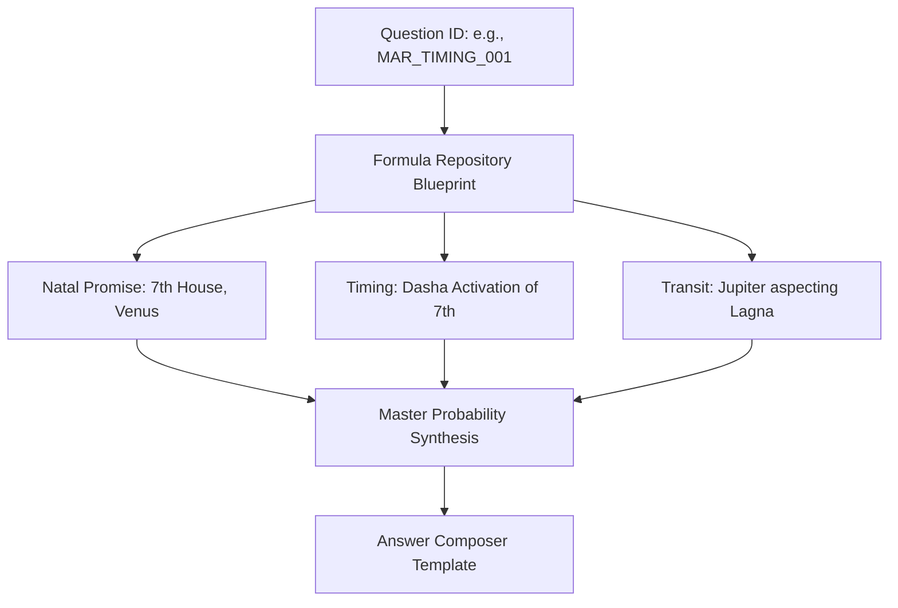

# QUESTION ENGINE KNOWLEDGE PACKAGE

## 1. Executive Summary
The Question Engine is the orchestration and resolution layer of the Vedic AI Golden Master platform. Its primary mission is to bridge natural language user queries (or explicit UI selections) with the strict, deterministic astrological mathematics of the backend engines. It sits at the top of the execution pipeline, completely decoupled from foundational astrological calculations, acting as a router and answer composer.

## 2. Architecture
The architecture is transitioning from a legacy NLP keyword-based router to a strict **Deterministic Question Registry Framework**.
- **Mode A (Direct Selection):** UI sends an explicit `question_id` (e.g., `MAR_TIMING_001`).
- **Mode B (Semantic Routing):** NLP matches natural language ("When will I marry?") to a `question_id`.
- **Mode C (Fuzzy/Fallback):** Maps fragmented keywords to the closest Parent Domain.

The architecture enforces a total separation of concerns: The Question Engine performs **zero astrological mathematics**. It reads evaluated boolean conditions and scores from the `PipelineRunner` and maps them to a response template.

## 3. Responsibility Matrix
| Component | Responsibility | Status |
| :--- | :--- | :--- |
| **Question Router** | Maps input to a `question_id`. Validates if required engine outputs are present. | Legacy Keyword |
| **Formula Loader** | Reads JSON/YAML blueprints for the `question_id` to determine required signals. | Pending |
| **Data Extractor** | Plucks the required variables from the `pipeline_output` (e.g., 7th Lord strength). | Implemented |
| **Master Probability** | Weights and synthesizes the probabilities for the specific domain. | Implemented |
| **Answer Composer** | Formats the extracted variables into a governed natural language response. | Legacy Text Concat |

## 4. Execution Flow
*(Execution DAG and sequence moved to `PIPELINE_RUNNER_KNOWLEDGE_PACKAGE.md`)*

## 5. Engine Dependency Diagram
*(Moved to `PIPELINE_RUNNER_KNOWLEDGE_PACKAGE.md`)*

## 6. Formula Dependency Diagram

## 7. Question Processing Flow
1. **Sanity Check:** Ensure `question_id` exists in the local registry.
2. **Data Availability Check:** Validate `pipeline_output` contains all mandated layers (e.g., `dashas.synthesis`).
3. **Strict Rejection:** Abort if required engine outputs are missing.
4. **Extraction:** Pull `natal_promise_score`, `active_mahadasha`, etc.
5. **LLM Delegation:** Send extracted JSON payload to LLM with a strict system prompt (no astrological inference allowed by LLM).

## 8. Data Flow
- **Inputs:** `question` (string), `domain` (string, optional), `pipeline_output` (dict containing all engine results).
- **Outputs:** `evaluated_formula` (dict), `final_probability` (dict), `top_opportunities` (list of future dates), `answer_text` (string).

## 9. Business Rules
- **No Mathematics in Router:** The Question Engine must NEVER recalculate base strength, calculate a Dasha timeline, or assess planetary dignities itself (Rule DR-007).
- **No Hallucinations:** The Answer Composer (LLM) must not invent data not explicitly present in the data context.
- **Missing Data Fallback:** If a domain cannot be routed, the engine falls back to the generalized `MasterProbabilityEngine` average score.

## 10. Deterministic Rules
- **Domain Priority Routing:** If multiple keywords match, priority goes: Marriage > Career > Wealth > Children > Education > Property > Health > Spirituality.
- **Probability Grader:** Maps a 0-100 score to qualitative labels (EXCELLENT, VERY GOOD, GOOD, WEAK, TOO WEAK).

## 11. Timing Rules
- **Layered Timing Trigger:** 
  1. Mahadasha (Broad activation)
  2. Antardasha (Primary trigger)
  3. Pratyantardasha (Precision trigger)
- **Activation Labeling:** Dasha timing multipliers map to HIGH (>=1.2), MODERATE (>=1.1), NEUTRAL (>=1.0), SUPPRESSED (<1.0).

## 12. Probability Rules
- *(Probability synthesis logic is constitutionally owned by `MASTER_PROBABILITY_KNOWLEDGE_PACKAGE.md`. The Question Engine strictly routes probabilities calculated by the Master Probability Engine and performs no synthesis itself.)*

## 13. Question Registry
The framework cascades from 24 Master Domains to 200+ specific child questions. Every child question defines its own mathematical requirements:
- `required_house_focus`
- `required_planets`
- `required_yogas`
- `required_dasha_check`

## 14. Current Canonical Questions
The currently implemented domains and baseline questions revolve around the keywords in `question_engine.py`:
- Marriage (Marriage, Spouse, Divorce)
- Career (Job, Promotion, Transfer)
- Wealth (Money, Lottery, Debt)
- Education (Study Abroad, Exams)
- Children (Progeny, Birth)
- Property (House, Real Estate)
- Health (Surgery, Disease)
- Spirituality (Moksha, Religion)

## 15. Expansion Strategy (150–200 Questions)
To scale to 200+ questions seamlessly without explosion of code:
- **Many-to-One Convergence:** Multiple semantic queries map to one Formula Variant (e.g., "Will I get a promotion?" and "When is my career growth?" both map to `CAR_GROWTH_TIMING`).
- **UI Browsing:** The frontend will feature a Collapsible Browser accordion grouped by House/Domain (e.g., 7.1 Marriage Prospects, 7.2 Marriage Timing), shifting reliance away from NLP and toward deterministic selection (Mode A).

## 16. Implementation Files
- `backend/app/engines/question_engine.py`
- `backend/app/pipeline_runner.py`
- `backend/app/engines/master_probability_engine.py`

## 17. Documentation Files
- `QUESTION_REGISTRY_ARCHITECTURE_v1.md`
- `QUESTION_ROUTER_CONTRACT_v1.md`
- `QUESTION_BROWSER_UI_BLUEPRINT_v1.md`
- `QUESTION_ENGINE_IMPLEMENTATION_PLAN_2026-06-19.md`

## 18. Governance References
- `FORMULA_LIBRARY_REVIEW_PACK.md`
- `FORMULA_MASTER_INDEX_PLAN.md`

## 19. Known Gaps
- **Legacy Routing:** `question_engine.py` currently uses a naive keyword lookup (`DOMAIN_KEYWORDS`) instead of the planned Question ID registry mapping.
- **Embedded Formatting:** The `compose_response()` method uses legacy text string concatenation instead of the planned 5-part qualitative structured response template.
- **Dosha Framework Missing:** Afflictions are not mathematically separated into the proposed `DoshaEngine` (-15% cap rule).
- **Master Probability Hardcoding:** *(Resolved via REF-BKL-002: Hardcoded math identified for removal to restore Orchestrator-Only purity.)*

## 20. Recommendations
1. **Implement Phase 10B (Router Refactoring):** Rip out `DOMAIN_KEYWORDS` and replace it with a semantic/ID-based router that fetches definitions from `registry_data.py`.
2. **Remove Math from Question Engine:** Delete the hardcoded 60/40 recalculation in `answer_question()`. Force the `PipelineRunner` to generate the correct domain-specific probability upfront.
3. **Build Answer Composer Module:** Extract `compose_response` into a dedicated templating engine (Phase 10D) that enforces the 5-part governed response (Promise, Strength, Reason, Timing, Advice).
