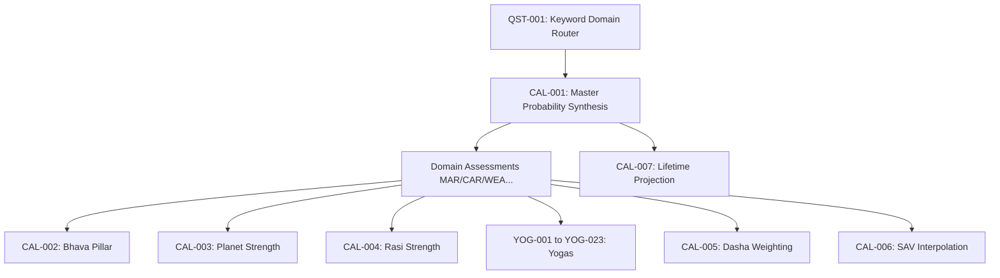

# FORMULA MASTER INDEX PLAN

## 1. Overview
This document defines the permanent Formula Registration System for the Golden Master repository. It assigns a definitive Formula ID to every mathematical evaluation and business rule, whether explicitly registered in the current schema or embedded as hidden logic within the engines.

---

## 2. Formula Family Hierarchy

```text
CAL (Core Calculations)
    CAL-001 : Master Probability Synthesis
    CAL-002 : Bhava Pillar (House Strength)
    CAL-003 : Planet Strength Aggregation
    CAL-004 : Rasi Strength Environmental Score
    CAL-005 : Dasha MD/AD Weighting (60/40)
    CAL-006 : Ashtakavarga SAV Interpolation
    CAL-007 : Lifetime Projection Calculation

YOG (Yoga Detection)
    YOG-001 : Gaja Kesari Yoga
    YOG-002 : Neecha Bhanga Raja Yoga
    YOG-003 : Adhi Yoga
    YOG-004 : Ruchaka Yoga
    YOG-005 : Bhadra Yoga
    YOG-006 : Hamsa Yoga
    YOG-007 : Malavya Yoga
    YOG-008 : Sasa Yoga
    YOG-009 : Dhana Yoga
    YOG-010 : Lakshmi Yoga
    YOG-011 : Vasumathi Yoga
    YOG-012 : Raja Yoga
    YOG-013 : Dharma Karma Adhipati Yoga
    YOG-014 : Amala Yoga
    YOG-015 : Saraswati Yoga
    YOG-016 : Vidya Yoga
    YOG-017 : Kalatra Yoga
    YOG-018 : Saubhagya Yoga
    YOG-019 : Putra Yoga
    YOG-020 : Santana Yoga
    YOG-021 : Moksha Yoga
    YOG-022 : Sanyasa Yoga
    YOG-023 : Parivraja Yoga

DOM (Domain Probability Assessments - Currently Registered)
    MAR-001 to MAR-003 : Marriage
    CAR-001 to CAR-003 : Career
    WEA-001 to WEA-003 : Wealth
    HLT-001 to HLT-006 : Health
    AST-001 to AST-005 : Property/Assets
    EDU-001 to EDU-005 : Education
    FAM-001 to FAM-003 : Progeny
    LIT-001 to LIT-004 : Litigation
    TRV-001 to TRV-004 : Travel
    SPR-001 to SPR-004 : Spirituality
    REL-001 to REL-003 : Compatibility

QST (Question Routing)
    QST-001 : Keyword Domain Router
```

---

## 3. Dependency Graph



---

## 4. Implementation Priorities

- **Priority 1**: `DOM` formulas (Already registered in `registry_data.py`. Need ID standardization).
- **Priority 2**: `CAL` and `YOG` formulas (Hidden deterministic formulas embedded in engine Python files).
- **Priority 3**: `CAL-005` Dasha Weighting (Duplicate implementation across Master Probability and Ashtakavarga engines).
- **Priority 4**: Documentation Only (Aligning the fragmented `.md` architecture files with the single source of truth).

---

## 5. Master Index (Sample of Core Categories)

### 5.1. Core Calculations (Hidden Formulas)

**Formula ID**: `CAL-001`
- **Formula Name**: Master Probability Synthesis
- **Purpose**: Combines all 7 astrological pillars into a final domain probability score.
- **Owner Engine**: `MasterProbabilityEngine`
- **Owner Module**: `master_probability_engine.py`
- **Inputs**: Natal Promise, Planet Strength, House Strength, Rasi Strength, Varga Validation, Dasha Activation, Transit Trigger.
- **Outputs**: `final_score`, `raw_score`, `grade`.
- **Dependencies**: All sub-engines.
- **Current Implementation File**: `backend/app/engines/master_probability_engine.py`
- **Documentation Files**: `docs/architecture/FORMULA_EVALUATOR_ARCHITECTURE_v1.md`
- **Current Status**: Implemented / Hardcoded
- **Hidden Formula**: Yes
- **Registered**: No
- **Candidate Priority**: Priority 2

**Formula ID**: `CAL-002`
- **Formula Name**: Bhava Pillar (House Strength)
- **Purpose**: Calculates house strength using SAV, occupants, aspects, and house type.
- **Owner Engine**: `HouseStrengthEngine`
- **Owner Module**: `house_strength_engine.py`
- **Inputs**: SAV Points, Occupants, Aspects, House Type, Yogas.
- **Outputs**: House `final_score`, `grade`, `breakdown`.
- **Dependencies**: `AshtakavargaEngine`, `YogaEngine`.
- **Current Implementation File**: `backend/app/engines/house_strength_engine.py`
- **Documentation Files**: None
- **Current Status**: Implemented / Hardcoded
- **Hidden Formula**: Yes
- **Registered**: No
- **Candidate Priority**: Priority 2

**Formula ID**: `CAL-005`
- **Formula Name**: Dasha MD/AD Weighting (60/40)
- **Purpose**: Calculates temporal activation based on Mahadasha and Antardasha multipliers.
- **Owner Engine**: Shared (`MasterProbabilityEngine`, `AshtakavargaEngine`)
- **Owner Module**: `master_probability_engine.py`, `ashtakavarga_engine.py`
- **Inputs**: MD Score, AD Score.
- **Outputs**: Combined Activation Score.
- **Dependencies**: `DashaEngine`
- **Current Implementation File**: `backend/app/engines/master_probability_engine.py`, `backend/app/engines/ashtakavarga_engine.py`
- **Documentation Files**: None
- **Current Status**: Implemented / Duplicated
- **Hidden Formula**: Yes
- **Registered**: No
- **Candidate Priority**: Priority 3

### 5.2. Yogas (Hidden Formulas)

*(Note: Applying standard structure to all 23 yogas; sample provided for brevity)*

**Formula ID**: `YOG-001`
- **Formula Name**: Gaja Kesari Yoga
- **Purpose**: Detects favorable relationship between Jupiter and Moon (in Kendra).
- **Owner Engine**: `YogaEngine`
- **Owner Module**: `yoga_engine.py`
- **Inputs**: Jupiter House, Moon House.
- **Outputs**: `status` (PASSED/FAILED), `rules` trace.
- **Dependencies**: None.
- **Current Implementation File**: `backend/app/engines/yoga_engine.py`
- **Documentation Files**: None
- **Current Status**: Implemented / Hardcoded
- **Hidden Formula**: Yes
- **Registered**: No
- **Candidate Priority**: Priority 2

**Formula ID**: `YOG-012`
- **Formula Name**: Raja Yoga
- **Purpose**: Detects conjunction between a Kendra Lord and a Trikona Lord.
- **Owner Engine**: `YogaEngine`
- **Owner Module**: `yoga_engine.py`
- **Inputs**: Lords of 4, 5, 9, 10 and their placements.
- **Outputs**: `status`, `rules`.
- **Dependencies**: None.
- **Current Implementation File**: `backend/app/engines/yoga_engine.py`
- **Documentation Files**: None
- **Current Status**: Implemented / Hardcoded
- **Hidden Formula**: Yes
- **Registered**: No
- **Candidate Priority**: Priority 2

### 5.3. Domain Assessments (Registered Formulas)

**Formula ID**: `MAR-001` (Currently `MAR_TIMING_BASE`)
- **Formula Name**: Marriage Timing Base
- **Purpose**: Base assessment for marriage timing events.
- **Owner Engine**: `QuestionEngine`
- **Owner Module**: `registry_data.py`
- **Inputs**: 7th house, 7th lord, Venus, Lagna Lord.
- **Outputs**: Linguistic template pointer (`timing_assessment_v1`).
- **Dependencies**: `NatalPromiseEngine`, `DashaEngine`.
- **Current Implementation File**: `backend/app/formulas/registry_data.py`
- **Documentation Files**: `FORMULA_FAMILY_CATALOG_v1.md`, `FORMULA_REPOSITORY_DATA_MODEL_v1.md`
- **Current Status**: Implemented
- **Hidden Formula**: No
- **Registered**: Yes
- **Candidate Priority**: Priority 1

**Formula ID**: `CAR-001` (Currently `CAR_GROWTH_BASE`)
- **Formula Name**: Career Growth Base
- **Purpose**: Base assessment for professional growth and trajectory.
- **Owner Engine**: `QuestionEngine`
- **Owner Module**: `registry_data.py`
- **Inputs**: 10th house, 10th lord, 11th house.
- **Outputs**: Linguistic template pointer.
- **Dependencies**: `NatalPromiseEngine`, `AshtakavargaEngine`, `DashaEngine`.
- **Current Implementation File**: `backend/app/formulas/registry_data.py`
- **Documentation Files**: `FORMULA_FAMILY_CATALOG_v1.md`
- **Current Status**: Implemented
- **Hidden Formula**: No
- **Registered**: Yes
- **Candidate Priority**: Priority 1
